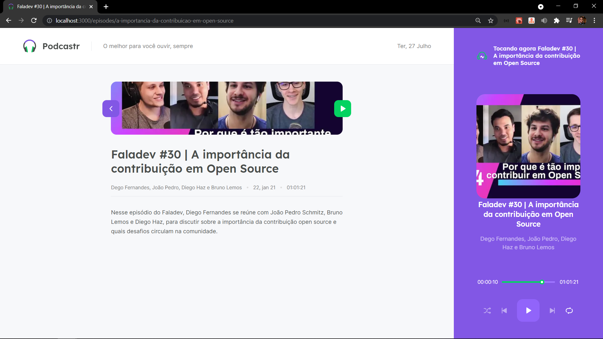
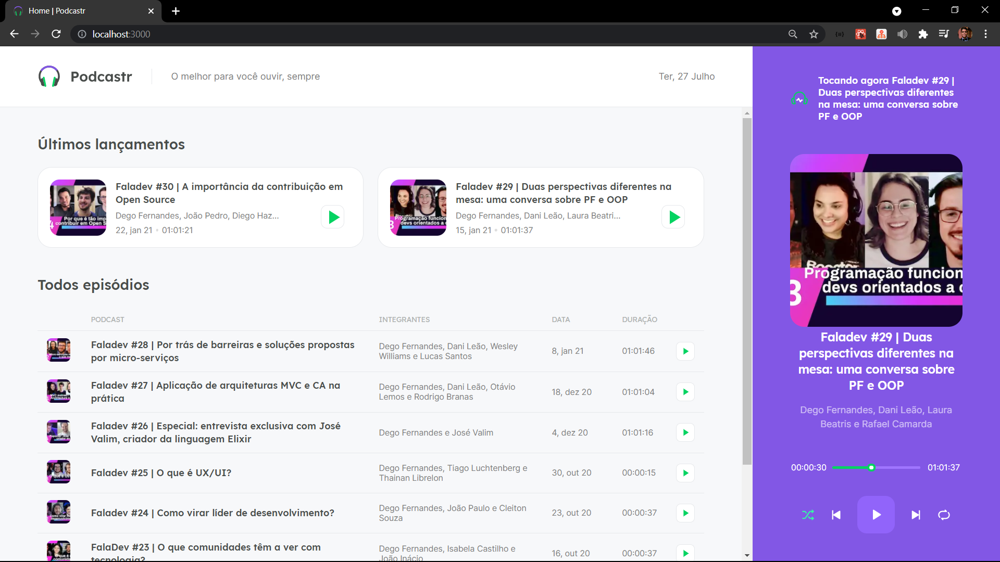
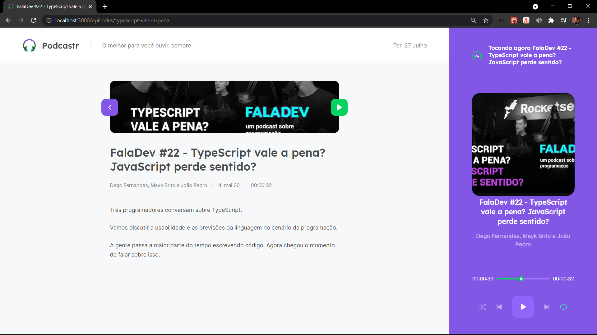

<h1 align="center">
    
</h1>

<br>

<p align="center">
  
</p>

<h4 align="center">
  A platform where you can listen your podcasts.
</h4>

<p align="center">
  <a href="#test_tube-technologies">Technologies</a>&nbsp;&nbsp;&nbsp;|&nbsp;&nbsp;&nbsp;
  <a href="#rocket-Getting-started">Getting started</a>&nbsp;&nbsp;&nbsp;|&nbsp;&nbsp;&nbsp;
  <a href="#desktop_computer-Project">Project</a>&nbsp;&nbsp;&nbsp;|&nbsp;&nbsp;&nbsp;
  <a href="#bookmark-Layout">Layout</a>&nbsp;&nbsp;&nbsp;|&nbsp;&nbsp;&nbsp;
  <a href="#sunny-result">Result</a>
</p>

## :test_tube: Technologies

This project was developed using the following technologies:

- [Next.js](https://nextjs.org/)
- [React](https://reactjs.org)
- [TypeScript](https://www.typescriptlang.org/)
- [SASS](https://sass-lang.com/documentation/js-api)

## :rocket: Getting started

Clone the project and access the folder

```bash
$ git clone https://github.com/Ivo-Jr/podcastr.git && cd podcastrnext
```

Follow the steps below
```bash
# Install the dependencies
$ yarn

# Run the JSON server
$ yarn server

# Start the project
$ yarn dev
```

## :desktop_computer: Project

This is a project developed during the **[Next Level Week](https://nextlevelweek.com/)**, presented by **[@Rocketseat](https://github.com/Rocketseat)** during April 19-25, 2021.

## :bookmark: Layout

You can view the project layout through the links below:

- [Layout Web](https://www.figma.com/file/UwFEntsHpHYJlHNQAQr4gA/Podcastr?node-id=160%3A2761) 

Remembering that you need to have a [Figma](http://figma.com/) account to access it.

## :sunny: Result

  <div style="display: flex;   flex-direction: column;
  align-items: center;">
  <h1 align="center" style="display: flex; flex-direction:row;">
      
       <br>
       <br>
       <br>
      
      <br>
      <br>
      <br>
      
  </h1>     
  </div>


<p align="center">Made with ❤ by Ivo Jr</p>
